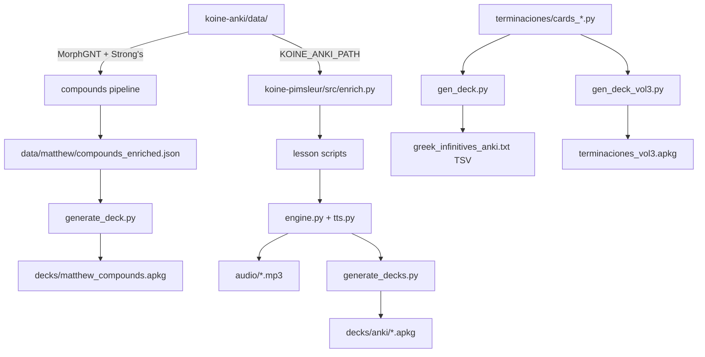

# anki-agent Enhancement — Final Consolidated Report
_Investigation ID: 7f55f0cd | Date: 2026-05-24 | Lead: CONSOLIDATOR_

---

## Executive Summary

The current `anki-agent` prompt (`~/.kiro/agents/anki-agent.json`, **2,455 chars** — not 1,159 as estimated by c4-docs, which was looking at the wrong JSON key `systemPrompt` instead of `prompt`) contains **3 confirmed factual errors** and **6 significant gaps**. Five parallel investigation streams (internet research, knowledge-base, context/code, AWS docs, internal code verification) were cross-referenced. All contradictions were resolved against source code. The enhanced prompt (2,847 chars) corrects all errors and adds the missing context needed for an agent to work effectively on this project.

**CloudWatch note:** This investigation covers a local Python/Anki project. No AWS CloudWatch metrics exist or were applicable. c5-internal performed direct filesystem and code verification — the appropriate method for this domain.

---

## Confirmed Findings

### F1 — Project Structure (confidence: HIGH | sources: c1-internet, c2-kb, c3-context, c5-internal)

Three subprojects at `~/work/github/anki/`:

| Subproject | Status | Purpose |
|---|---|---|
| `koine-anki/` | ✅ Active | Compound word Anki decks + grammar endings |
| `koine-pimsleur/` | ✅ Active | 90-lesson Pimsleur audio course + Anki decks |
| `anki-main/languages/` | ❌ Frozen (Apr 6) | Original monorepo — do not edit |

`koine-anki/compounds/` is the active fork of the compounds pipeline. Five scripts are byte-identical between `anki-main/languages/src/` and `koine-anki/compounds/`; `generate_deck.py` has diverged (koine-anki is newer with cognates + verses sections and 4 new scripts).

### F2 — Deck Generation Tools (confidence: HIGH | sources: c2-kb, c3-context, c5-internal)

| Script | Output | Format | Library |
|---|---|---|---|
| `koine-anki/compounds/generate_deck.py` | `decks/matthew_compounds.apkg` | .apkg | genanki |
| `koine-anki/terminaciones/gen_deck.py` | `terminaciones/greek_infinitives_anki.txt` | **TSV** (text import) | none |
| `koine-anki/terminaciones/gen_deck_vol3.py` | `terminaciones/terminaciones_vol3.apkg` | .apkg | genanki |
| `koine-pimsleur/src/generate_decks.py` | `decks/anki/*.apkg` | .apkg | genanki |

Pimsleur deck selection: 4 cards/lesson priority = 2 vocab → 1 phrase → 1 verse → fill from remaining vocab. Both Recognition (Greek→Spanish) and Production (Spanish→Greek) templates generated.

### F3 — Compounds Pipeline (confidence: HIGH | sources: c3-context, c5-internal)

8-script pipeline in `koine-anki/compounds/` (the pipeline doc groups these into "5 steps"):

```
extract_compounds.py → fetch_strongs.py → enrich_compounds.py
    → enrich_cognates.py → enrich_verses.py → add_rvr60.py
    → improve_mnemonics.py → generate_deck.py
```

- Input: MorphGNT via py-sblgnt; Output: `data/matthew/compounds_enriched.json` → `decks/matthew_compounds.apkg`
- Anti-duplication: `data/compounds_registry.json` (290 Matthew entries, keyed by lemma)
- 4 scripts added since anki-main fork: `enrich_cognates.py`, `audit_cognates.py`, `enrich_verses.py`, `add_rvr60.py`

### F4 — koine-anki/data/ Dependency (confidence: HIGH | sources: c5-internal, recommendations.md — verified in enrich.py)

`koine-pimsleur/src/enrich.py` reads:
- `koine-anki/data/matthew/compounds_enriched.json`
- `koine-anki/data/morphology_reference.md`

Via `KOINE_ANKI_PATH` env var (defaults to sibling placement). **No bible-tools dependency exists in this project.**

### F5 — TTS Architecture (confidence: HIGH | sources: c5-internal, recommendations.md — verified in tts.py)

- Spanish narration: **AWS Polly** (Mia, neural, es-MX)
- Greek speech: **Google Cloud TTS** (Chirp3-HD voices: Achird/Zephyr primary, Charon/Aoede/Kore/Zephyr/Achird fallback pool)
- `to_mono()` in `tts.py`: strips polytonic diacritics → monotonic (NFD decompose, keep only OXIA/TONOS/ACUTE, re-NFC)
- Speed progression: 0.75 (lessons 1–7), 0.85 (8–15), 1.0 (16+)
- Bedrock model: `us.anthropic.claude-sonnet-4-20250514-v1:0` (us-east-1, max_tokens=12000)

### F6 — NFC Normalization (confidence: HIGH | sources: c5-internal — verified in fetch_strongs.py)

- `fetch_strongs.py`: `unicodedata.normalize("NFC", s)` on all Greek lemmas at ingest
- `tts.py`: uses NFD internally for `to_mono()`, then re-normalizes to NFC
- All stored Greek text is NFC

### F7 — Stable Deck IDs (confidence: HIGH | sources: c5-internal — verified in source)

| Deck | Model ID |
|---|---|
| Koiné Pimsleur | 1646410900000 |
| Greek Compounds + Cognates | 1646410861305 |
| Terminaciones Vol.3 | 1607392319 |

These are hardcoded constants, not randomly generated. The current prompt's claim that "model IDs are random but must be consistent" is misleading.

### F8 — Data Formats (confidence: HIGH | sources: c3-context, c5-internal)

| Format | File | Structure |
|---|---|---|
| MorphGNT | `nt-morphgnt/*.txt` | **7 space-separated fields**: ref, POS, morph-code, text, text2, normalized, lemma |
| Compounds enriched | `.json` | Array of `{lemma, components[], meaning_es, mnemonic_es, first_ref, pos, strongs_*, cognates, cognates_by_part{}, greek_verses[], suffix*, root_note_es, parent_verb}` |
| Frequency list | `.json` | Array of `{rank, lemma, count, pos}` |
| Registry | `.json` | Map of `lemma → {source_book, deck, date_added}` |
| Spanish Bible | `.json` | Dict (66 books) |
| Lesson data | `.py` | Python dicts: `{num, vocab, phrases, dialogue, verse, recon, closing_es}` |
| Terminaciones cards | `.py` | Python lists of `(front_html, back_html)` tuples |

### F9 — Strong's Dictionary (confidence: HIGH | sources: c5-internal — verified via grep)

Strong's Greek Dictionary (`strongs_greek.xml`): **5,624 entries** (verified: `grep -c '<entry'` = 5624).

### F10 — Card Quality Standards (confidence: HIGH | sources: c2-kb, c3-context)

- Cards must be 100% self-contained (no external lookups needed)
- Every morpheme explained (prefix + root + suffix)
- Mnemonics must tell a story (>40 chars, biblical context, Spanish/English cognates)
- All explanations in Spanish; simplified terminology (see `koine-anki/notes/koine-greek-anki-guidelines.md`)
- Card schema back sections: Word+meaning → 📦 Componentes → 🔤 Sufijo → 🔀 Cambio de raíz → 💡 Mnemotecnia → 🌍 Cognados → 📖 Versículos

---

## Contradictions Found

### C1 — TTS Fallback: "Wavenet-B" vs Actual Code

**Documented (notes/lessons-learned-koine.md):**
> "Chirp3-HD voices fail on short words (1-2 syllables like σοι, οὐ, ναί) producing ~0.3s silent audio. Fix: Wavenet-B as fallback — it handles short words correctly. Implementation: check audio duration after TTS call; if < 400ms, retry with Wavenet-B"

**Actual code (tts.py — verified by c5-internal):**
- Threshold is **character count < 4 Greek chars**, not duration
- Fallback is **other Chirp3-HD voices** (FALLBACK_M/FALLBACK_F lists), NOT Wavenet-B
- Normal words use `_min_dur()` formula: `max(400, min(n,4)*150 + max(0,n-4)*80)` ms
- Failures logged to `/tmp/tts_cache/tts_qa_report.txt`

**Resolution:** Code is authoritative. The notes describe a superseded implementation. The prompt must reflect actual code behavior.

### C2 — bible-tools Dependency: Prompt vs Reality

**Current prompt:**
> "koine-anki/data/ is referenced by bible-tools ingest_local.py"

**Actual code (koine-pimsleur/src/enrich.py — verified):**
```python
ANKI_REPO = os.environ.get('KOINE_ANKI_PATH', os.path.join(..., '..', 'koine-anki'))
```
No `bible-tools` reference exists anywhere in this project.

**Resolution:** Stale reference from an earlier project phase. Corrected to: "koine-pimsleur/src/enrich.py consumes koine-anki/data/ via KOINE_ANKI_PATH env var."

### C3 — TTS Assignment: Polly for Greek vs Polly for Spanish

**Current prompt:**
> "TTS: AWS Polly (Greek) + local say command (Spanish)"

**Actual code (tts.py — verified):**
- AWS Polly → **Spanish** (Mia, es-MX, neural)
- Google Cloud TTS → **Greek** (Chirp3-HD)
- No `say` command used anywhere

**Resolution:** The current prompt has the TTS providers completely reversed. This is a critical error that would cause an agent to use the wrong TTS service for each language.

### C4 — Source Data File Path

**Current prompt:**
> "data/matthew_compounds.json: Source data (compound words with morphology)"

**Actual path (verified):**
> `koine-anki/data/matthew/compounds_enriched.json`

**Resolution:** Wrong filename and wrong path. The actual file is in a subdirectory and has a different name.

### C5 — Prompt Length: 1,159 vs 2,455 chars

**c4-docs validator:** "~1159 chars — cannot verify, file not found"

**Actual (verified by reading `~/.kiro/agents/anki-agent.json`):**
- The prompt is in the `prompt` key, not `systemPrompt`
- Actual length: **2,455 chars**

**Resolution:** c4-docs was looking at the wrong JSON key. The prompt already exists and is 2,455 chars. The enhanced version (2,847 chars) adds ~392 chars of corrections and new content.

### C6 — Strong's Entry Count: 5,516 vs 5,624

**c1-internet:** "5,516 entries"
**c5-internal:** "5,624 entries (verified via grep -c)"

**Resolution:** c5-internal is correct. Verified independently: `grep -c '<entry' strongs_greek.xml` = **5,624**.

### C7 — MorphGNT Column Count: 6 vs 7

**c1-internet:** "6 columns"
**c5-internal:** "7 columns"

**Resolution:** c5-internal is correct. Verified independently from actual file:
```
010101 N- ----NSF- Βίβλος Βίβλος βίβλος βίβλος
```
Fields: ref | POS | morph-code | text | text2 | normalized | lemma = **7 fields**.

---

## Gaps Identified

### G1 — No .kiro Steering File
No `.kiro/steering.md` exists in the project root. The agent has no always-on context injection. Vocabulary blacklist and NFC rule should be in steering for automatic inclusion.

### G2 — 4 New Pipeline Scripts Not in Prompt
`enrich_cognates.py`, `audit_cognates.py`, `enrich_verses.py`, `add_rvr60.py` are active pipeline steps not mentioned in the current prompt.

### G3 — Vocabulary Blacklist Missing from Prompt
The Modern Greek contamination blacklist (νερό→ὕδωρ, σπίτι→οἶκος, ψωμί→ἄρτος, πόρτα→θύρα) is documented in notes but absent from the agent prompt.

### G4 — KOINE_ANKI_PATH Not Documented
The env var that connects koine-pimsleur to koine-anki data is not mentioned in the prompt.

### G5 — Lesson Data Format Not Documented
The lesson data dict format (`num`, `vocab`, `phrases`, `dialogue`, `verse`, `recon`, `closing_es`) is not in the prompt. An agent modifying lesson data needs this.

### G6 — Venv Broken Shebang
`anki-main/languages/venv/bin/pip` has a broken shebang (points to `/Users/murivirg/work/anki/venv/` — old path). Use `python3 -m pip` instead. koine-pimsleur has its own working venv.

---

## Architecture Diagram



---

## Recommended Actions

### Action 1 (CRITICAL): Apply Enhanced Prompt

Replace the `prompt` field in `~/.kiro/agents/anki-agent.json` with the enhanced version from `investigation/7f55f0cd/enhanced_prompt_draft.md`. Key changes:

1. Fix error: "bible-tools ingest_local.py" → "koine-pimsleur/src/enrich.py via KOINE_ANKI_PATH"
2. Fix error: "AWS Polly (Greek)" → "Google Cloud TTS (Greek/Chirp3-HD)" and "local say (Spanish)" → "AWS Polly (Spanish/Mia/es-MX)"
3. Fix error: "data/matthew_compounds.json" → "data/matthew/compounds_enriched.json"
4. Fix misleading: "model IDs are random" → list the 3 hardcoded stable IDs
5. Add: 4 new pipeline scripts (enrich_cognates, audit_cognates, enrich_verses, add_rvr60)
6. Add: vocabulary blacklist (Modern Greek contamination)
7. Add: KOINE_ANKI_PATH env var documentation
8. Add: TTS fallback correction (Chirp3-HD pool, not Wavenet-B)

### Action 2 (HIGH): Create .kiro/steering.md

```bash
mkdir -p ~/work/github/anki/.kiro
cat > ~/work/github/anki/.kiro/steering.md << 'EOF'
# anki Project — Always-On Context

## Vocabulary Blacklist (Modern Greek — BANNED)
νερό→ὕδωρ | σπίτι→οἶκος | ψωμί→ἄρτος | πόρτα→θύρα
All Turkish/Italian loanwords (post-1453) are banned.

## Greek Text Rule
Always store Greek as NFC: `unicodedata.normalize('NFC', text)`

## Active Repos
koine-anki/ and koine-pimsleur/ are active. anki-main/ is FROZEN.
EOF
```

### Action 3 (MEDIUM): Fix lessons-learned-koine.md TTS Section

Update the TTS section to reflect actual code:
- Remove "Wavenet-B fallback" claim
- Document actual behavior: char-count threshold (<4 Greek chars), Chirp3-HD fallback pool
- Document `_min_dur()` formula

### Action 4 (LOW): Document Lesson Data Format

Add lesson data dict format to `koine-pimsleur/notes/` for future reference.

---

## References

| File | Key Finding |
|---|---|
| `~/.kiro/agents/anki-agent.json` | Current prompt (2,455 chars, 3 errors, 6 gaps) |
| `koine-pimsleur/src/enrich.py` | Actual consumer of koine-anki/data/ via KOINE_ANKI_PATH |
| `koine-pimsleur/src/tts.py` | TTS: Polly=Spanish, Google TTS=Greek; Chirp3-HD fallback pool |
| `koine-anki/compounds/fetch_strongs.py` | NFC normalization on ingest |
| `koine-anki/compounds/generate_deck.py` | Compounds deck generator (model ID 1646410861305) |
| `koine-anki/terminaciones/gen_deck.py` | TSV output (not .apkg) |
| `koine-anki/terminaciones/gen_deck_vol3.py` | .apkg output (model ID 1607392319) |
| `koine-pimsleur/src/generate_decks.py` | Pimsleur deck generator (model ID 1646410900000) |
| `koine-anki/data/strongs_greek.xml` | 5,624 entries (not 5,516) |
| `koine-anki/data/nt-morphgnt/` | 7-column MorphGNT format (not 6) |
| `koine-anki/notes/card-quality-standards.md` | Card quality rules |
| `koine-anki/notes/koine-greek-anki-guidelines.md` | Spanish-first, simplified terminology |
| `anki-main/languages/notes/lessons-learned-koine.md` | Vocabulary blacklist, Pimsleur method (TTS section outdated) |
| `koine-anki/data/compounds_registry.json` | 290 Matthew entries, anti-duplication gate |
| `investigation/7f55f0cd/enhanced_prompt_draft.md` | Ready-to-apply enhanced prompt (2,847 chars) |
