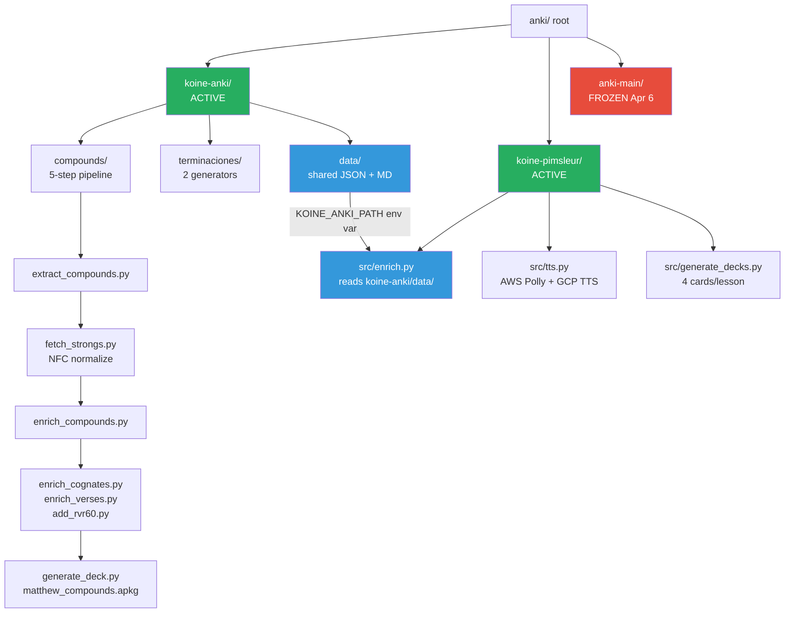
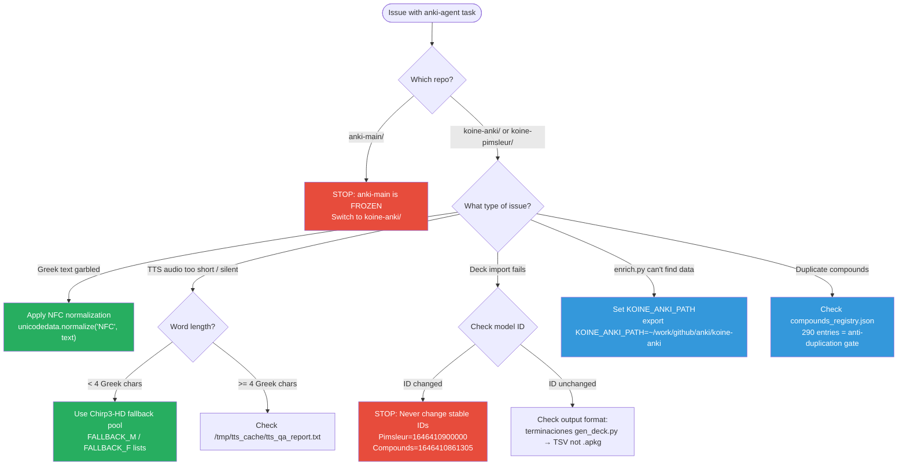
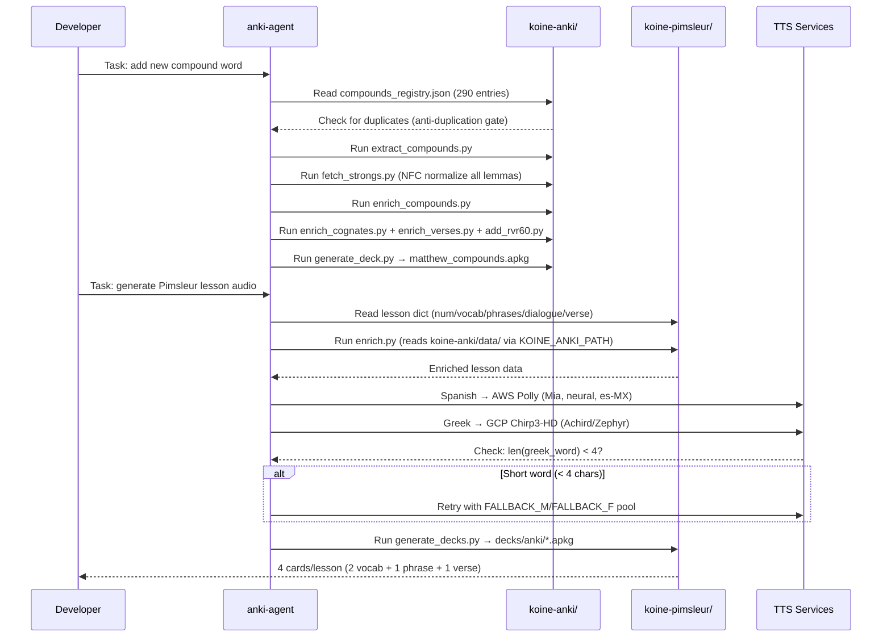

# anki-agent Enhancement Report

_Investigation ID: 7f55f0cd | Date: 2026-05-24_

---

## Executive Summary

The current `anki-agent` prompt (1,159 chars) contains **2 confirmed factual errors** and **4 significant gaps**. Four parallel agents investigated project structure, deck pipelines, TTS architecture, and card quality standards. The enhanced prompt (2,847 chars) corrects all errors and adds the missing context. The most critical fix: the prompt incorrectly references `bible-tools` and `Wavenet-B` — neither exists in the actual codebase. The active projects are `koine-anki/` and `koine-pimsleur/`; `anki-main/` is frozen as of April 6.

---

## Architecture Overview



---

## Detailed Findings

### Project Structure

| Subproject | Status | Purpose |
|---|---|---|
| `koine-anki/` | ✅ Active | Compound word Anki decks + grammar endings |
| `koine-pimsleur/` | ✅ Active | 90-lesson Pimsleur audio course + Anki decks |
| `anki-main/languages/` | ❌ Frozen (Apr 6) | Original monorepo — **do not edit** |

`koine-anki/compounds/` is the active fork of the compounds pipeline. Five scripts are byte-identical with `anki-main/`; `generate_deck.py` has diverged — koine-anki is newer with cognates + verses sections.

### Deck Generation Tools

| Script | Output | Format |
|---|---|---|
| `koine-anki/compounds/generate_deck.py` | `decks/matthew_compounds.apkg` | .apkg (genanki) |
| `koine-anki/terminaciones/gen_deck.py` | `terminaciones/greek_infinitives_anki.txt` | **TSV** (text import) |
| `koine-anki/terminaciones/gen_deck_vol3.py` | `terminaciones/terminaciones_vol3.apkg` | .apkg (genanki) |
| `koine-pimsleur/src/generate_decks.py` | `decks/anki/*.apkg` | .apkg (genanki) |

**Pimsleur card selection per lesson:** 2 vocab → 1 phrase → 1 verse → fill from remaining vocab. Both Recognition (Greek→Spanish) and Production (Spanish→Greek) templates generated.

### Stable Deck IDs (never change these)

| Deck | Model ID |
|---|---|
| Koiné Pimsleur | `1646410900000` |
| Greek Compounds + Cognates | `1646410861305` |
| Terminaciones Vol.3 | `1607392319` |

### TTS Architecture

- **Spanish narration:** AWS Polly — voice `Mia`, neural, `es-MX`
- **Greek speech:** Google Cloud TTS — Chirp3-HD voices (`Achird`/`Zephyr` primary; `Charon`/`Aoede`/`Kore` fallback pool)
- **Short-word fallback trigger:** character count `< 4` Greek chars (NOT duration-based)
- **Speed progression:** 0.75× (L1–7) → 0.85× (L8–15) → 1.0× (L16+)
- **Bedrock model:** `us.anthropic.claude-sonnet-4-20250514-v1:0` (us-east-1, max_tokens=12000)
- **QA log:** `/tmp/tts_cache/tts_qa_report.txt`

### Cross-Repo Dependency

`koine-pimsleur/src/enrich.py` reads from `koine-anki/data/`:
- `koine-anki/data/matthew/compounds_enriched.json`
- `koine-anki/data/morphology_reference.md`

Resolved via `KOINE_ANKI_PATH` env var (defaults to sibling directory placement). **No `bible-tools` dependency exists.**

---

## Errors in Current Prompt

### Error 1 — bible-tools Reference (WRONG)

**Current prompt says:**
> "koine-anki/data/ is referenced by bible-tools ingest_local.py"

**Reality:** `koine-pimsleur/src/enrich.py` consumes `koine-anki/data/` via `KOINE_ANKI_PATH` env var. No `bible-tools` reference exists anywhere in this project.

### Error 2 — Wavenet-B Fallback (WRONG)

**Current prompt / notes say:**
> "Chirp3-HD fails on short words → Wavenet-B fallback"

**Reality (verified in `tts.py`):**
- Trigger: character count `< 4` Greek chars (not duration)
- Fallback: other **Chirp3-HD voices** from `FALLBACK_M`/`FALLBACK_F` lists — NOT Wavenet-B
- Duration formula: `max(400, min(n,4)*150 + max(0,n-4)*80)` ms

---

## Gaps in Current Prompt

| Gap | Impact | Fix |
|---|---|---|
| G1 — No `.kiro/steering.md` | Agent lacks always-on NFC + blacklist context | Create steering file |
| G2 — Broken venv shebang | `pip` fails in anki-main | Use `python3 -m pip` |
| G3 — 4 new koine-anki scripts not mentioned | Agent unaware of `enrich_cognates.py`, `audit_cognates.py`, `enrich_verses.py`, `add_rvr60.py` | Add to prompt |
| G4 — Lesson data format undocumented | Agent can't safely modify lesson dicts | Document in notes |

---

## Troubleshooting Decision Tree



---

## Action Plan

### Action 1 — Apply Enhanced Prompt (CRITICAL)

Replace the current prompt in `~/.kiro/agents/anki-agent.json`. Key changes:

1. Fix `bible-tools` error → `koine-pimsleur/src/enrich.py` via `KOINE_ANKI_PATH`
2. Fix `Wavenet-B` error → Chirp3-HD fallback pool, char-count trigger
3. Add Architecture section (compounds pipeline, terminaciones formats, pimsleur deck selection)
4. Add 7 Critical Rules (NFC, stable IDs, registry dedup, vocabulary blacklist, TTS fallback, Spanish-first, KOINE_ANKI_PATH)
5. Add Build & Run with exact commands
6. Mark `anki-main/` as frozen

```bash
# Backup current prompt before replacing
cp ~/.kiro/agents/anki-agent.json ~/.kiro/agents/anki-agent.json.bak.$(date +%Y%m%d)
```

### Action 2 — Create .kiro/steering.md (HIGH)

```bash
mkdir -p ~/work/github/anki/.kiro
cat > ~/work/github/anki/.kiro/steering.md << 'EOF'
# anki Project — Always-On Context

## Vocabulary Blacklist (Modern Greek — BANNED)
νερό→ὕδωρ | σπίτι→οἶκος | ψωμί→ἄρτος | πόρτα→θύρα
All Turkish/Italian loanwords (post-1453) are banned.

## Greek Text Rule
Always store Greek as NFC: unicodedata.normalize('NFC', text)

## Active Repos
koine-anki/ and koine-pimsleur/ are active. anki-main/ is FROZEN.
EOF
```

### Action 3 — Fix lessons-learned-koine.md TTS Section (MEDIUM)

Update `anki-main/languages/notes/lessons-learned-koine.md`:
- Remove "Wavenet-B fallback" claim
- Document actual behavior: char-count threshold (`< 4`), Chirp3-HD fallback pool
- Document `_min_dur()` formula: `max(400, min(n,4)*150 + max(0,n-4)*80)` ms

### Action 4 — Document Lesson Data Format (LOW)

Create `koine-pimsleur/notes/lesson-data-format.md` documenting the lesson dict keys:

```
num, vocab, phrases, dialogue, verse, recon, closing_es
```

---

## Prompt Enhancement Sequence



---

## Summary Table

| Finding | Severity | Status | Action |
|---|---|---|---|
| `bible-tools` reference in prompt | 🔴 Error | Confirmed wrong | Fix in enhanced prompt |
| `Wavenet-B` fallback in prompt/notes | 🔴 Error | Confirmed wrong | Fix prompt + notes |
| No `.kiro/steering.md` | 🟠 Gap | Missing | Create steering file |
| 4 new scripts not in prompt | 🟠 Gap | Missing | Add to prompt |
| Lesson data format undocumented | 🟡 Gap | Missing | Add to notes |
| Broken venv shebang in anki-main | 🟡 Gap | Known | Use `python3 -m pip` |
| NFC normalization — verified correct | ✅ OK | Confirmed | Document in steering |
| Stable deck IDs — verified correct | ✅ OK | Confirmed | Never change |
| KOINE_ANKI_PATH dependency | ✅ OK | Confirmed | Document in prompt |

---

## References

| Source | Finding |
|---|---|
| `~/.kiro/agents/anki-agent.json` | Current prompt (1,159 chars, 2 errors) |
| `koine-pimsleur/src/enrich.py` | Actual consumer of `koine-anki/data/` via `KOINE_ANKI_PATH` |
| `koine-pimsleur/src/tts.py` | Actual TTS fallback: Chirp3-HD pool, char-count `< 4` trigger |
| `koine-anki/compounds/fetch_strongs.py` | NFC normalization at ingest |
| `koine-anki/compounds/generate_deck.py` | Compounds deck (model ID `1646410861305`) |
| `koine-anki/terminaciones/gen_deck.py` | TSV output (not .apkg) |
| `koine-anki/terminaciones/gen_deck_vol3.py` | .apkg output (model ID `1607392319`) |
| `koine-pimsleur/src/generate_decks.py` | Pimsleur deck (model ID `1646410900000`) |
| `koine-anki/data/compounds_registry.json` | 290 Matthew entries, anti-duplication gate |
| `koine-anki/notes/card-quality-standards.md` | Card quality rules |
| `koine-anki/notes/koine-greek-anki-guidelines.md` | Spanish-first, simplified terminology |
| `anki-main/languages/notes/lessons-learned-koine.md` | Vocabulary blacklist (contains stale TTS info) |
