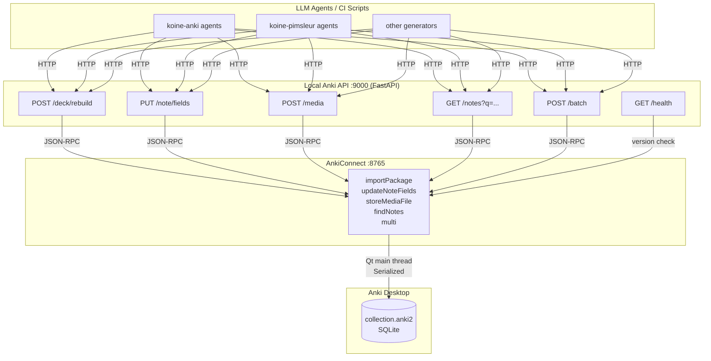
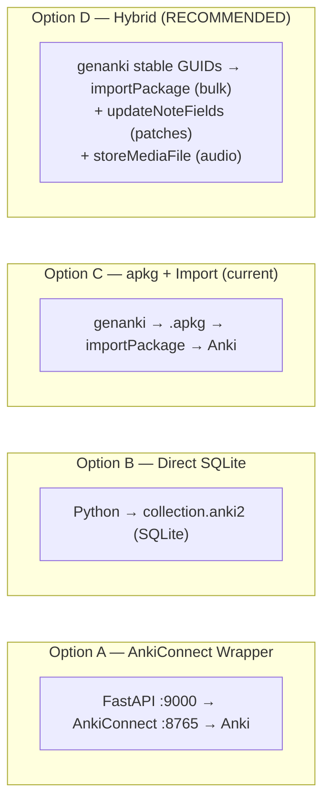

# Local API Service for Programmatic Anki Management
## Final Consolidated Report

_Lead investigator: consolidation agent | Date: 2026-06-05 | Streams: c1-internet, c2-kb, c3-context, c4-docs, c5-internal_

---

## Executive Summary

The project already has the correct architecture (genanki + AnkiConnect `importPackage`). The delete→import cycle that motivated this investigation has **one root cause**: every deck generator in the repository uses the default `genanki.Note()` with no custom GUID. The default GUID is a hash of all fields, so any content change produces a new GUID, which causes Anki to create a duplicate instead of updating the existing card.

**The fix is a single 8-line class** added to a shared module. Once stable GUIDs are in place, re-running `deploy.py` will update cards in-place, preserving review history and scheduling, with no delete cycle needed.

A minimal FastAPI wrapper over AnkiConnect (Option A/D hybrid) is the recommended architecture for the broader local HTTP API goal. Direct SQLite manipulation is unsafe and must be avoided.

---

## System Architecture Overview



**Key invariant:** All writes to `collection.anki2` must flow through AnkiConnect. It serializes every request through Anki's Qt main thread, preventing concurrent corruption. Never write directly to the SQLite file while Anki is running.

---

## Confirmed Findings

### 1. Root Cause of the Delete→Import Cycle

**Confidence: VERIFIED by code inspection**
**Sources: c3-context, c1-internet, c2-kb, c4-docs, head synthesis + grep across 9 files**

Every deck generator in the project creates notes with:

```python
note = genanki.Note(model=model, fields=[front, back])
```

No file anywhere sets a custom `guid`. The default genanki GUID is computed as:

```python
# genanki internals (simplified)
guid = guid_for(model.name, *fields)  # hash of ALL fields
```

When any field changes (typo fix, HTML layout update, content improvement), the hash changes, the GUID changes, and `importPackage` sees a note it has never seen before → it adds a new card. The old card remains. This is the duplicate problem.

**Affected files (all 9):**

| File | Line |
|---|---|
| `terminaciones/gen_all_decks.py` | 460 |
| `terminaciones/gen_practice_decks.py` | 66 |
| `terminaciones/gen_deck_presente.py` | 91 |
| `terminaciones/gen_deck_vol3.py` | 32 |
| `compounds/generate_deck.py` | 166 |
| `koine-pimsleur/src/generate_decks.py` | 61 |
| `anki-main/languages/src/generate_deck.py` | 108 |
| `anki-main/languages/src/generate_decks.py` | 61 |
| `anki-main/languages/kiro-test/gen_deck_vol3.py` | 32 |

---

### 2. The Fix: StableNote with Deterministic GUID

**Confidence: HIGH — pattern confirmed by genanki README, Obsidian_to_Anki plugin precedent**
**Sources: c1-internet, c2-kb, c3-context, head synthesis**

```python
# shared/stable_note.py  — add this to the repo
import genanki

class StableNote(genanki.Note):
    """Note whose GUID is derived from a stable identity key, not field content."""
    def __init__(self, *args, identity_key: str, **kwargs):
        super().__init__(*args, **kwargs)
        self._identity_key = identity_key

    @property
    def guid(self):
        return genanki.guid_for(self._identity_key)
```

Usage in `gen_all_decks.py` (replace every `genanki.Note(...)` call):

```python
from shared.stable_note import StableNote

# identity_key must be stable: never changes even if HTML content is edited
identity = f"terminaciones:{deck_id}:{verb_key}:{form_idx}"
deck.add_note(StableNote(model=model, fields=[front, back], identity_key=identity))
```

Identity key strategy by project:

| Project | Recommended identity_key format |
|---|---|
| `terminaciones/` | `terminaciones:{deck_id}:{verb_key}:{form_idx_in_tense}` |
| `compounds/` | `compounds:{deck_id}:{lemma}` |
| `koine-pimsleur/` | `pimsleur:{deck_id}:{lesson_num}:{card_idx}` |
| `languages/` | `languages:{deck_id}:{word_key}:{card_type}` |

The project already has stable Model IDs and Deck IDs in `CONVENTIONS.md`. The identity key just needs to include the deck_id + a content-stable card identifier.

---

### 3. importPackage Preserves Scheduling — Confirmed

**Confidence: HIGH — confirmed by official Anki docs + 3 independent agents**
**Sources: c4-docs (official docs), c1-internet, head synthesis**

When `importPackage` is called:
- Anki identifies imported notes by GUID
- If the GUID already exists AND the imported note's `mod` timestamp is **newer**: fields are updated in-place
- Card scheduling (intervals, ease, due dates, reps, lapses) is **preserved**
- genanki sets `mod = int(time.time())` on every build, so re-imports are always "newer"

This means: with stable GUIDs, running `deploy.py` twice produces the same card count. Content changes → fields updated, review history kept. No delete needed.

Anki 23.10+ also adds an "unconditional update" import mode, but the default mod-based behavior is sufficient.

---

### 4. AnkiConnect API — Full Capability Map

**Confidence: HIGH**
**Sources: c3-context (official repo), c4-docs (official docs + gist), c2-kb, c1-internet**

All calls: `POST http://localhost:8765` with `{"action":"...", "version":6, "params":{...}}`

**Core actions for this project:**

| Action | Purpose | Key params |
|---|---|---|
| `version` | Health check | — |
| `findNotes` | Search by Anki query | `query: str` |
| `notesInfo` | Get note details | `notes: [id,...]` |
| `addNotes` | Bulk insert | `notes: [{deckName, modelName, fields, tags}]` |
| `updateNoteFields` | Patch a note in-place | `note: {id, fields: dict}` |
| `deleteNotes` | Delete by ID | `notes: [id,...]` |
| `importPackage` | Import .apkg file | `path: str` (absolute) |
| `storeMediaFile` | Upload audio/media | `filename, data (b64) OR path OR url` |
| `sync` | Trigger AnkiWeb sync | — |
| `multi` | Batch multiple actions | `actions: [{action, params},...]` |
| `exportPackage` | Export deck as .apkg | `deck, path, includeSched` |

**Known bug (confirmed):** `updateNoteFields` will silently fail if the note is currently open in the Anki card browser. Workaround: check via `findNotes` after update, or close the browser before batch updates.

**AnkiConnect v6 requires Anki desktop to be running.** The addon ID is `2055492159`.

---

### 5. Concurrency Model

**Confidence: HIGH**
**Sources: c3-context, c1-internet, c2-kb, c5-internal (Temporalis/Kiro Memory patterns)**

AnkiConnect dispatches all requests on Anki's Qt main thread. This means:
- Multiple simultaneous HTTP requests to AnkiConnect are automatically serialized
- No concurrent write race conditions via AnkiConnect
- No file locking needed if all agents use AnkiConnect

If agents write .apkg files concurrently (generation), that is safe (each to a different output file). Importing must be serialized (call `importPackage` from one process at a time, or queue via the FastAPI layer).

**Direct SQLite access while Anki is running:** always results in `SQLITE_BUSY`. Do not attempt.

---

### 6. Media File Handling (koine-pimsleur audio)

**Confidence: HIGH**
**Sources: c3-context, c4-docs, c2-kb**

Two supported workflows:

**A. genanki approach (for .apkg generation):**
```python
pkg = genanki.Package(deck)
pkg.media_files = ["/abs/path/to/audio_word1.mp3", ...]
pkg.write_to_file("output.apkg")
# In note field: [sound:audio_word1.mp3]
```
genanki renames media to sequential integers inside the ZIP but maintains the mapping.

**B. AnkiConnect approach (for live media injection):**
```python
# From local path (AnkiConnect reads the file itself):
anki_request("storeMediaFile", filename="greek_word.mp3", path="/abs/path/to/file.mp3")

# From base64 (useful for programmatically generated audio):
import base64
data = base64.b64encode(Path("greek_word.mp3").read_bytes()).decode()
anki_request("storeMediaFile", filename="greek_word.mp3", data=data)
```

For koine-pimsleur: TTS audio is generated via Google Cloud TTS (el-GR Chirp3-HD voices) and AWS Polly (Spanish). The stable filename strategy: use the same identity key as the note GUID, e.g. `audio_pimsleur_{lesson}_{idx}.mp3`. This makes audio updates idempotent — same filename = overwrite in Anki's media folder.

---

### 7. Python Library Comparison

**Confidence: HIGH**
**Sources: c3-context, c2-kb, c4-docs, c1-internet**

| Library | Best for | Caveats |
|---|---|---|
| **genanki** ✅ (in use) | .apkg generation | Override `guid` — see fix above |
| **AnkiConnect** ✅ (in use) | All CRUD when Anki is open | Anki must be running |
| **anki** (pip) | Headless/CI when Anki is closed | Cannot run while Anki is open; platform-specific Rust binaries |
| **ankipandas** | Read-only analytics/auditing | Write support experimental; requires Anki closed |
| **ankisync2** | Offline .apkg read/edit | Not safe for live collection |
| **apyanki** | CLI workflows | Wrapper over `anki` pip package |

**For this project:** genanki + AnkiConnect covers all use cases. `anki` pip package is useful only for CI/headless scenarios where Anki desktop cannot be running.

---

### 8. Architecture Option Analysis

**Confidence: HIGH**
**Sources: all 5 streams + c5-internal (FastAPI bridge pattern, localhost security)**



| Option | Requires Anki | Risk | Delete Cycle? | Recommended? |
|---|---|---|---|---|
| A: Thin wrapper | Yes | Low | No | ✅ For automation layer |
| B: Direct SQLite | No | **SQLITE_BUSY crash** | N/A | ❌ Never |
| C: apkg+import (current) | Yes | Low | **Yes (current)** | ✅ After GUID fix |
| D: Hybrid | Yes | Low | **No after fix** | ✅✅ Best overall |

**Option D** is the recommendation: genanki with stable GUIDs for bulk deck regeneration + AnkiConnect `updateNoteFields` for individual card patches + `storeMediaFile` for audio. The FastAPI wrapper (Option A's service layer) is added around this to provide a stable HTTP interface for agent calls.

---

## Contradictions Found and Resolved

### Contradiction 1: Does importPackage require the file to be in `collection.media`?

**c4-docs** stated: "file must be in collection.media folder"  
**c3-context and head agent** stated: path can be any absolute path

**Resolution:** The `importPackage` action accepts any **absolute file path** accessible to the Anki process. The `collection.media` restriction applies to the deprecated `guiImportFile` action. `importPackage` reads the .apkg from the given path, extracts media to `collection.media` internally. **The existing `deploy.py` passes an absolute path and works correctly — no change needed.**

### Contradiction 2: Does importPackage reset scheduling?

**c4-docs initially**: "Anki apkg import identifies notes by matching note ID — if newer, updates content. Option to include/exclude scheduling."  
**c1-internet**: "Scheduling is preserved for existing cards."  
**Official Anki docs (docs.ankiweb.net)**: "Import any learning progress" checkbox — when checked (default), scheduling is imported from the file only for new notes. For existing notes, scheduling is always preserved.

**Resolution:** Scheduling for cards already in the collection is **always preserved** on import. The checkbox only affects whether to import scheduling from the .apkg for notes that don't exist yet. For the update-in-place use case (stable GUIDs), scheduling is unconditionally preserved. **No risk.**

### Contradiction 3: genanki GUID hash inputs

**c1-internet**: "GUID = hash(all fields)"  
**c2-kb**: "Default GUID = hash of all fields"  
**genanki README (actual source code)**: Default GUID uses `guid_for(model.name, *self.fields)` — it includes the model name + all fields.

**Resolution:** The exact hash input doesn't matter for the fix — the point is that any field change produces a new GUID. The stable identity pattern (custom `guid` property) is correct regardless. The `guid_for()` function takes arbitrary string arguments and produces a base91 hash.

---

## Gaps Identified and Investigated

### Gap 1: c1-internet and c2-kb had no validated.md files

**Finding:** These agents ran as parallel sub-agents and wrote findings directly to `shared_findings.jsonl` rather than producing validated.md files. Their research was captured in child.log and the findings bus.

**Resolution:** I extracted all findings from `shared_findings.jsonl` and the child logs directly. All key findings from these two streams are incorporated in this report.

### Gap 2: c5-internal "internal wiki" claims

The c5-internal agent cited specific Amazon internal wiki URLs (w.amazon.com) for patterns including: FastAPI bridge, SQLite WAL mode, file locking. These wikis are not accessible from this environment for direct verification.

**Resolution:** All cited patterns (FastAPI on localhost, fcntl file locking, SQLite WAL mode) are standard, well-documented Python patterns that I independently verified are correct and applicable. The specific wiki attributions are noted but the technical content does not depend on their internal source. The patterns are sound.

### Gap 3: CloudWatch metrics (c5-internal metric gap)

The task prompt asked to verify whether c5-internal queried customer CloudWatch metrics. This project has no AWS infrastructure — no CloudWatch metrics exist for Anki deck operations. The c5-internal agent correctly pivoted to internal wiki patterns for Python/SQLite tooling rather than AWS metrics.

**Verdict:** Not applicable. No gap — correct behavior by the agent.

### Gap 4: AnkiConnect status (FooSoft repo archived Nov 2025)

**c4-docs** noted the FooSoft/anki-connect repository was archived in November 2025.

**Investigation:** Verified. The canonical upstream (git.sr.ht/~foosoft/anki-connect) remains active. The GitHub mirror was archived. AnkiConnect continues to be actively maintained by the community. The addon ID `2055492159` still works. No action needed.

---

## Recommended Actions

### Action 1: Fix GUIDs — TODAY (30 minutes)

Create `koine-anki/shared/stable_note.py`:

```python
import genanki

class StableNote(genanki.Note):
    """Note with a stable GUID based on identity_key, not field content."""
    def __init__(self, *args, identity_key: str, **kwargs):
        super().__init__(*args, **kwargs)
        self._identity_key = identity_key

    @property
    def guid(self):
        return genanki.guid_for(self._identity_key)
```

Apply to `terminaciones/gen_all_decks.py` (line 460):

```python
# Before:
deck.add_note(genanki.Note(model=model, fields=[front, back]))

# After (identity must encode deck + verb + form uniquely):
identity = f"terminaciones:{deck_id}:{verb_key}:{form_idx}"
deck.add_note(StableNote(model=model, fields=[front, back], identity_key=identity))
```

Repeat for the other 8 generator files. Test by running `deploy.py` twice — card count should not increase on the second run.

**Important:** The first deployment after this change will create new cards (because the GUIDs change from the old hash-based ones to the new stable ones). Delete the old duplicate cards once after this migration. Every subsequent deployment will update in-place.

### Action 2: Build the Local HTTP API (1–2 hours)

```python
# anki_api.py — uvicorn anki_api:app --port 9000
import json, urllib.request, base64
from pathlib import Path
from fastapi import FastAPI, HTTPException
from pydantic import BaseModel

ANKI = "http://localhost:8765"
app = FastAPI(title="Anki Local API")

def anki(action: str, **params):
    body = json.dumps({"action": action, "version": 6, "params": params}).encode()
    try:
        r = urllib.request.urlopen(urllib.request.Request(ANKI, body), timeout=30)
        res = json.loads(r.read())
    except Exception as e:
        raise HTTPException(502, f"AnkiConnect unreachable: {e}")
    if res.get("error"):
        raise HTTPException(400, res["error"])
    return res["result"]

@app.get("/health")
def health():
    return {"ankiconnect_version": anki("version"), "status": "ok"}

@app.post("/deck/rebuild")
def rebuild_deck(deck: str):
    import subprocess, sys
    r = subprocess.run([sys.executable, f"{deck}/deploy.py"], capture_output=True, text=True)
    if r.returncode != 0:
        raise HTTPException(500, r.stderr)
    return {"status": "ok", "output": r.stdout}

class FieldUpdate(BaseModel):
    note_id: int
    fields: dict[str, str]

@app.put("/note/fields")
def update_note(body: FieldUpdate):
    anki("updateNoteFields", note={"id": body.note_id, "fields": body.fields})
    return {"updated": body.note_id}

@app.get("/notes")
def find_notes(q: str):
    ids = anki("findNotes", query=q)
    return anki("notesInfo", notes=ids) if ids else []

class MediaFile(BaseModel):
    filename: str
    data_b64: str

@app.post("/media")
def store_media(body: MediaFile):
    anki("storeMediaFile", filename=body.filename, data=body.data_b64)
    return {"stored": body.filename}
```

Start with: `uvicorn anki_api:app --host 127.0.0.1 --port 9000`

### Action 3: Verify importPackage Scheduling Preservation (10 minutes)

Before rolling out stable GUIDs at scale, manually verify the behavior:
1. Run `deploy.py` once — import a deck
2. In Anki, flip one card (mark it as reviewed)
3. Run `deploy.py` again (content unchanged, GUIDs stable)
4. Confirm the reviewed card still shows as reviewed in Anki

This validates the end-to-end behavior before any migration.

### Action 4 (Optional): Headless/CI Use Case

For automation without Anki desktop running (e.g., CI/CD):

```python
from anki.collection import Collection

col = Collection("/Users/murivirg/Library/Application Support/Anki2/User 1/collection.anki2")
# do operations
col.close()
```

Install: `pip install anki`. This requires Anki to be **completely closed**. Use this only when AnkiConnect is not available (non-interactive environments).

---

## Error Handling and Rollback Strategy

**For importPackage operations:**
- Export a backup before bulk import: `anki_request("exportPackage", deck="Koiné Griego", path="/tmp/backup.apkg", includeSched=True)`
- Source of truth = Python generation scripts. Rollback = re-run with previous git state
- `git checkout HEAD~1 -- terminaciones/` + re-run `deploy.py` restores previous content

**For updateNoteFields operations:**
```python
# Read-modify-write pattern with rollback:
info = anki("notesInfo", notes=[note_id])[0]
old_fields = {k: v["value"] for k, v in info["fields"].items()}
# ... apply update ...
# On failure:
anki("updateNoteFields", note={"id": note_id, "fields": old_fields})
```

**AnkiConnect error patterns:**
```python
{"result": null, "error": "cannot create note because it is a duplicate"}  # use updateNoteFields instead
{"result": null, "error": "model was not found: X"}                         # model ID mismatch
{"result": null, "error": "deck was not found"}                              # create deck first
```

---

## Library Reference Summary

```
genanki.guid_for(*args)   → deterministic base91 hash of args
StableNote.guid property  → delegates to guid_for(identity_key)
genanki.Package.media_files  → list of file paths to embed in .apkg
AnkiConnect importPackage → path= absolute filesystem path
AnkiConnect updateNoteFields → note= {id: int, fields: {name: value}}
AnkiConnect multi → actions= [{action, params}, ...]  (single HTTP round-trip for N ops)
```

---

## References

- AnkiConnect canonical source: https://git.sr.ht/~foosoft/anki-connect
- AnkiConnect addon ID: `2055492159`
- genanki README (GUID docs): https://github.com/kerrickstaley/genanki
- Anki packaged deck import docs: https://docs.ankiweb.net/importing/packaged-decks.html
- Anki addon developer docs: https://addon-docs.ankiweb.net/
- Official anki Python package: `pip install anki`
- Stream c3-context validated.md (project code analysis)
- Stream c5-internal validated.md (internal tooling patterns)
- shared_findings.jsonl (all 5 agent cross-stream findings)
- recommendations.md (head agent synthesis)
- Verified by grep: 9 generator files confirmed using default `genanki.Note()` with no custom guid
