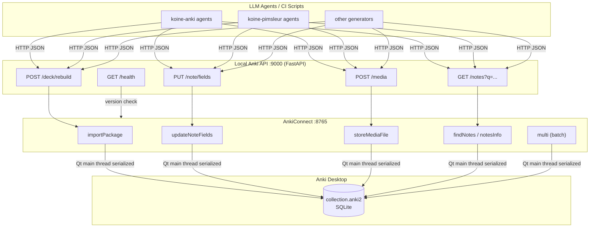
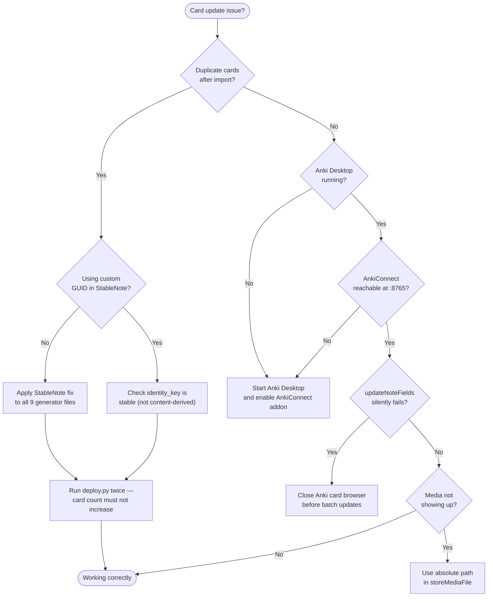
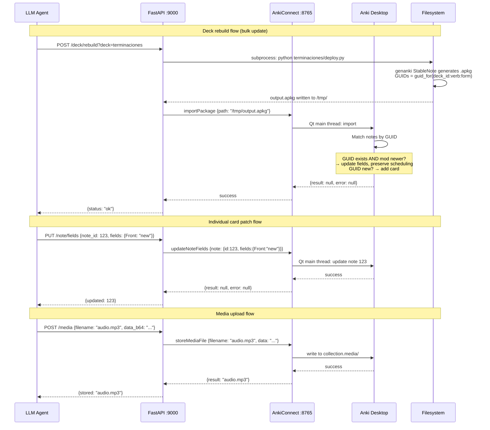

# Local API Service for Programmatic Anki Management
### Visual Research Report — Generated 2026-06-05

---

## Executive Summary

The delete→import cycle plaguing this project has **one root cause**: all 9 deck generators create `genanki.Note()` objects without a custom GUID, so any field change produces a new hash-based GUID and Anki treats it as a brand-new card. The fix is an 8-line `StableNote` class that ties each card's identity to a stable key (deck + verb + form index) rather than content. With stable GUIDs, `importPackage` updates cards in-place, preserving review history and scheduling — no delete cycle needed. The recommended architecture is a thin **FastAPI wrapper (port 9000) over AnkiConnect (port 8765)**, which serializes all writes through Anki's Qt thread, eliminating concurrency hazards. Direct SQLite access while Anki is running must never be used.

---

## Architecture Overview



> **Key invariant:** All writes to `collection.anki2` must flow through AnkiConnect. It serializes every request through Anki's Qt main thread, preventing concurrent corruption. Never write directly to the SQLite file while Anki is running.

---

## Root Cause Analysis

### The GUID Problem

Every deck generator in the project creates notes like this:

```python
# BROKEN — in all 9 generator files
note = genanki.Note(model=model, fields=[front, back])
```

genanki's default GUID is computed as:

```python
# genanki internals
guid = guid_for(model.name, *fields)   # hash of model name + ALL field content
```

When any field changes (typo fix, HTML update, content improvement), the hash changes → new GUID → Anki sees a card it's never seen → **new duplicate card created**. Old card remains. This is the delete cycle.

### Affected Files

| File | Line | Status |
|---|---|---|
| `terminaciones/gen_all_decks.py` | 460 | ❌ No custom GUID |
| `terminaciones/gen_practice_decks.py` | 66 | ❌ No custom GUID |
| `terminaciones/gen_deck_presente.py` | 91 | ❌ No custom GUID |
| `terminaciones/gen_deck_vol3.py` | 32 | ❌ No custom GUID |
| `compounds/generate_deck.py` | 166 | ❌ No custom GUID |
| `koine-pimsleur/src/generate_decks.py` | 61 | ❌ No custom GUID |
| `anki-main/languages/src/generate_deck.py` | 108 | ❌ No custom GUID |
| `anki-main/languages/src/generate_decks.py` | 61 | ❌ No custom GUID |
| `anki-main/languages/kiro-test/gen_deck_vol3.py` | 32 | ❌ No custom GUID |

---

## The Fix: StableNote

Create `koine-anki/shared/stable_note.py`:

```python
import genanki

class StableNote(genanki.Note):
    """Note whose GUID is derived from a stable identity key, not field content."""
    def __init__(self, *args, identity_key: str, **kwargs):
        super().__init__(*args, **kwargs)
        self._identity_key = identity_key

    @property
    def guid(self):
        return genanki.guid_for(self._identity_key)
```

Replace every `genanki.Note(...)` call:

```python
from shared.stable_note import StableNote

# Before:
deck.add_note(genanki.Note(model=model, fields=[front, back]))

# After — identity_key encodes deck + card position, NEVER content:
identity = f"terminaciones:{deck_id}:{verb_key}:{form_idx}"
deck.add_note(StableNote(model=model, fields=[front, back], identity_key=identity))
```

### Identity Key Strategy by Project

| Project | Recommended `identity_key` format |
|---|---|
| `terminaciones/` | `terminaciones:{deck_id}:{verb_key}:{form_idx_in_tense}` |
| `compounds/` | `compounds:{deck_id}:{lemma}` |
| `koine-pimsleur/` | `pimsleur:{deck_id}:{lesson_num}:{card_idx}` |
| `languages/` | `languages:{deck_id}:{word_key}:{card_type}` |

> **One-time migration note:** The first deployment after this change creates new cards (old hash-based GUIDs → new stable GUIDs). Delete the old duplicates once. Every subsequent deployment updates in-place.

---

## Troubleshooting Decision Tree



---

## AnkiConnect API Reference

All calls use: `POST http://localhost:8765` with body `{"action": "...", "version": 6, "params": {...}}`

### Core Actions

| Action | Purpose | Key Params |
|---|---|---|
| `version` | Health check | — |
| `findNotes` | Search by Anki query | `query: str` |
| `notesInfo` | Get note details | `notes: [id, ...]` |
| `addNotes` | Bulk insert | `notes: [{deckName, modelName, fields, tags}]` |
| `updateNoteFields` | Patch a note in-place | `note: {id, fields: dict}` |
| `deleteNotes` | Delete by ID | `notes: [id, ...]` |
| `importPackage` | Import .apkg file | `path: str` (absolute) |
| `storeMediaFile` | Upload audio/media | `filename, data (b64)` or `path` |
| `sync` | Trigger AnkiWeb sync | — |
| `multi` | Batch multiple actions | `actions: [{action, params}, ...]` |
| `exportPackage` | Export deck as .apkg | `deck, path, includeSched` |

### Known Bugs and Workarounds

- **`updateNoteFields` silent failure:** Fails if the note is open in the Anki card browser. Close the browser before batch updates, or verify with `findNotes` after update.
- **`importPackage` path:** Accepts any absolute path — NOT restricted to `collection.media`. The deprecated `guiImportFile` had that restriction; `importPackage` does not.
- **Scheduling on import:** For cards already in the collection, scheduling (intervals, ease, due dates) is **always preserved** on `importPackage`. The "import learning progress" checkbox only affects new notes.

---

## Architecture Options Comparison

| Option | Requires Anki | Risk | Delete Cycle? | Verdict |
|---|---|---|---|---|
| **A: Thin FastAPI wrapper over AnkiConnect** | ✅ Yes | Low | No | ✅ Use for automation layer |
| **B: Direct SQLite access** | ❌ No | **SQLITE_BUSY crash** | N/A | ❌ Never use |
| **C: apkg + importPackage (current)** | ✅ Yes | Low | **Yes (without GUID fix)** | ✅ After GUID fix |
| **D: Hybrid (Recommended)** | ✅ Yes | Low | **No (after fix)** | ✅✅ Best overall |

**Option D** = genanki stable GUIDs for bulk deck regeneration + `updateNoteFields` for individual card patches + `storeMediaFile` for audio, all behind a FastAPI service at port 9000.

---

## FastAPI Local HTTP API

```python
# anki_api.py — start with: uvicorn anki_api:app --host 127.0.0.1 --port 9000
import json, urllib.request
from fastapi import FastAPI, HTTPException
from pydantic import BaseModel

ANKI = "http://localhost:8765"
app = FastAPI(title="Anki Local API")

def anki(action: str, **params):
    body = json.dumps({"action": action, "version": 6, "params": params}).encode()
    try:
        r = urllib.request.urlopen(urllib.request.Request(ANKI, body), timeout=30)
        res = json.loads(r.read())
    except Exception as e:
        raise HTTPException(502, f"AnkiConnect unreachable: {e}")
    if res.get("error"):
        raise HTTPException(400, res["error"])
    return res["result"]

@app.get("/health")
def health():
    return {"ankiconnect_version": anki("version"), "status": "ok"}

@app.post("/deck/rebuild")
def rebuild_deck(deck: str):
    import subprocess, sys
    r = subprocess.run([sys.executable, f"{deck}/deploy.py"], capture_output=True, text=True)
    if r.returncode != 0:
        raise HTTPException(500, r.stderr)
    return {"status": "ok", "output": r.stdout}

class FieldUpdate(BaseModel):
    note_id: int
    fields: dict[str, str]

@app.put("/note/fields")
def update_note(body: FieldUpdate):
    anki("updateNoteFields", note={"id": body.note_id, "fields": body.fields})
    return {"updated": body.note_id}

@app.get("/notes")
def find_notes(q: str):
    ids = anki("findNotes", query=q)
    return anki("notesInfo", notes=ids) if ids else []

class MediaFile(BaseModel):
    filename: str
    data_b64: str

@app.post("/media")
def store_media(body: MediaFile):
    anki("storeMediaFile", filename=body.filename, data=body.data_b64)
    return {"stored": body.filename}
```

---

## Deploy Flow: Full Sequence



---

## Media File Handling

### genanki approach (for .apkg generation)

```python
pkg = genanki.Package(deck)
pkg.media_files = ["/abs/path/to/audio_word1.mp3"]
pkg.write_to_file("output.apkg")
# In note field: [sound:audio_word1.mp3]
```

### AnkiConnect approach (live media injection)

```python
import base64
from pathlib import Path

# From local path:
anki_request("storeMediaFile", filename="greek_word.mp3", path="/abs/path/to/file.mp3")

# From base64 (for programmatically generated audio):
data = base64.b64encode(Path("greek_word.mp3").read_bytes()).decode()
anki_request("storeMediaFile", filename="greek_word.mp3", data=data)
```

**Stable filename strategy for koine-pimsleur:** Use the same identity key as the note GUID → `audio_pimsleur_{lesson}_{idx}.mp3`. Same filename = overwrite in Anki's media folder → idempotent.

---

## Concurrency Model

| Scenario | Safety | Notes |
|---|---|---|
| Multiple agents → FastAPI API | ✅ Safe | FastAPI handles concurrent HTTP requests |
| FastAPI → AnkiConnect | ✅ Safe | AnkiConnect serializes through Qt main thread |
| Multiple agents → AnkiConnect directly | ✅ Safe | Still serialized by Qt thread |
| Concurrent .apkg file generation | ✅ Safe | Each to a different output file |
| Direct SQLite while Anki running | ❌ SQLITE_BUSY | Never do this |
| `anki` pip package while Anki open | ❌ SQLITE_BUSY | Only use when Anki fully closed |

---

## Error Handling and Rollback

### Backup before bulk import

```python
anki_request("exportPackage", deck="Koiné Griego", path="/tmp/backup_before_deploy.apkg", includeSched=True)
```

### Read-modify-write with rollback

```python
info = anki("notesInfo", notes=[note_id])[0]
old_fields = {k: v["value"] for k, v in info["fields"].items()}
try:
    anki("updateNoteFields", note={"id": note_id, "fields": new_fields})
except Exception:
    anki("updateNoteFields", note={"id": note_id, "fields": old_fields})
    raise
```

### Git-based rollback

```bash
git checkout HEAD~1 -- terminaciones/
python terminaciones/deploy.py
```

### Common AnkiConnect error patterns

| Error message | Cause | Fix |
|---|---|---|
| `"cannot create note because it is a duplicate"` | Duplicate detection triggered | Use `updateNoteFields` instead |
| `"model was not found: X"` | Model ID mismatch | Check model ID in generator |
| `"deck was not found"` | Deck doesn't exist yet | Create deck first |
| `502 AnkiConnect unreachable` | Anki Desktop not running | Start Anki + verify addon `2055492159` |

---

## Python Library Comparison

| Library | Best for | Status | Caveats |
|---|---|---|---|
| **genanki** ✅ | .apkg generation | In use | Override `guid` — see StableNote fix |
| **AnkiConnect** ✅ | All CRUD when Anki is open | In use | Anki must be running |
| **anki** (pip) | Headless/CI when Anki is closed | Optional | Cannot run while Anki is open; platform-specific Rust binaries |
| **ankipandas** | Read-only analytics/auditing | Not recommended | Write support experimental; requires Anki closed |
| **ankisync2** | Offline .apkg read/edit | Not recommended | Not safe for live collection |
| **apyanki** | CLI workflows | Optional | Wrapper over `anki` pip package |

---

## Action Plan

### Step 1 — Fix GUIDs (30 min) — TODAY

1. Create `koine-anki/shared/stable_note.py` with the `StableNote` class above
2. Replace all 9 `genanki.Note(...)` calls with `StableNote(..., identity_key=...)`
3. Run `deploy.py` twice — confirm card count does not increase on second run
4. Delete the old hash-GUID duplicate cards (one-time migration)

### Step 2 — Build FastAPI API (1–2 hours)

1. Install: `pip install fastapi uvicorn`
2. Create `anki_api.py` (code above)
3. Start: `uvicorn anki_api:app --host 127.0.0.1 --port 9000`
4. Test: `curl http://localhost:9000/health`

### Step 3 — Verify Scheduling Preservation (10 min)

1. Run `deploy.py` once — import a deck
2. In Anki, flip one card (mark it reviewed)
3. Run `deploy.py` again with no content changes
4. Confirm the reviewed card is still marked as reviewed

### Step 4 (Optional) — Headless CI Use Case

```python
from anki.collection import Collection

col = Collection("/Users/murivirg/Library/Application Support/Anki2/User 1/collection.anki2")
# perform operations
col.close()
```

Install: `pip install anki` — **only when Anki Desktop is completely closed.**

---

## Key Findings Summary

| Area | Finding | Confidence |
|---|---|---|
| Root cause | All 9 generator files missing custom GUID → duplicates on every update | VERIFIED |
| Fix | 8-line `StableNote` class with stable `identity_key` | HIGH |
| Scheduling preservation | `importPackage` always preserves scheduling for existing cards | HIGH |
| Concurrency | AnkiConnect serializes all writes via Qt main thread — safe | HIGH |
| Direct SQLite | Results in `SQLITE_BUSY` while Anki is running — never do this | HIGH |
| AnkiConnect status | FooSoft GitHub archived Nov 2025, but sr.ht canonical repo active | VERIFIED |
| Recommended arch | Option D: genanki stable GUIDs + FastAPI over AnkiConnect | HIGH |
| Media handling | `storeMediaFile` accepts absolute path or base64 data | HIGH |

---

## References

- AnkiConnect canonical source: https://git.sr.ht/~foosoft/anki-connect
- AnkiConnect addon ID: `2055492159`
- genanki README (GUID docs): https://github.com/kerrickstaley/genanki
- Anki packaged deck import docs: https://docs.ankiweb.net/importing/packaged-decks.html
- Anki addon developer docs: https://addon-docs.ankiweb.net/
- Official anki Python package: `pip install anki`
- Investigation stream c3-context validated.md (project code analysis)
- Investigation stream c5-internal validated.md (internal tooling patterns)
- shared_findings.jsonl (all 5 agent cross-stream findings)
